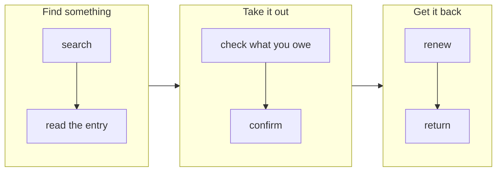

# {Project} — Implementation specification

**Owns.** How the product is operated and presented: what someone is trying to get done, and how
each surface behaves while they do it.

**Not here.** What the product *is* and the rules it obeys
([domain-spec.md](domain-spec.md)) · technology ([tech-spec.md](tech-spec.md)) · tokens and visual
states ([style-guide.md](style-guide.md)) · which of this is in the current release
([implementation-tracking.md](implementation-tracking.md)).

**Rule of thumb.** If it would still be true with a completely different interface, it belongs in
the domain spec. If it changes when the interface changes, it belongs here.

**Identifiers.** `IS-n.n` sits on **surface behaviours only**. Journeys carry none — they are
narrative, they get reworded often, and identity on a volatile thing is how citations rot. A
journey instead *names the surfaces it passes through*, and its end-to-end test cites that set.
Identity lives on the stable thing; the volatile thing points at it, exactly as `[?Hn]` works in
the domain spec.

Written by `/story-map`. Surface sections are filled in per goal, not up front —
see [workflow.md](workflow.md).

---

## How the two parts divide

**A journey says what someone does. A surface says how it behaves.** No sentence appears in both.

The division is strict, and it is what stops this document collapsing back into one pile:

| | Journey | Surface |
|---|---|---|
| Voice | *"picks a border, taps a clump"* | *"a tap under the drag threshold selects; past it, it is a pan"* |
| Changes when | the product's purpose changes | the interface changes |
| Reads as | continuous prose | a specification |

When a surface is central to a journey it is tempting to restate its behaviour so the journey
reads well. Don't. Name what the person is doing and link; a journey that has to explain a widget
is describing the widget, and the widget already has a section.

## Backbone

Small on purpose. It orients the prose below; it is not a map of the product, and it does not try
to be exhaustive. Every step here appears as a journey step below, and no journey step is missing
from it — `/sanity-check` reports either way round.

Mermaid renders in GitHub and in most editors' preview, so the diagram stays in the document
rather than beside it as an image nobody regenerates.

---

# Part 1 — Journeys

## {Activity}
*Surfaces: §n {name} · §n {name}*

{Short narrative prose. What the person is trying to do, in order, linking to the surface that
does each part. Domain rules are cited by identifier where the journey turns on one.}

---

# Part 2 — Surfaces

## 1. {Surface}
*Serves: {journey} → {step}*

- **[IS-1.1]** {A behaviour, stated so it could be tested. Where a naive alternative exists, say
  in one clause why it was rejected — that is what stops it being "fixed" back later.}

---

# Future — how this might work

UX ideas deliberately not in this release: ways the product could look or be operated, as against
things it could *be*, which belong in [domain-spec.md](domain-spec.md)'s own Future section.
*Decided against, for now* goes to [implementation-tracking.md](implementation-tracking.md)'s
**Parked** — this section is for what has not been decided at all.
