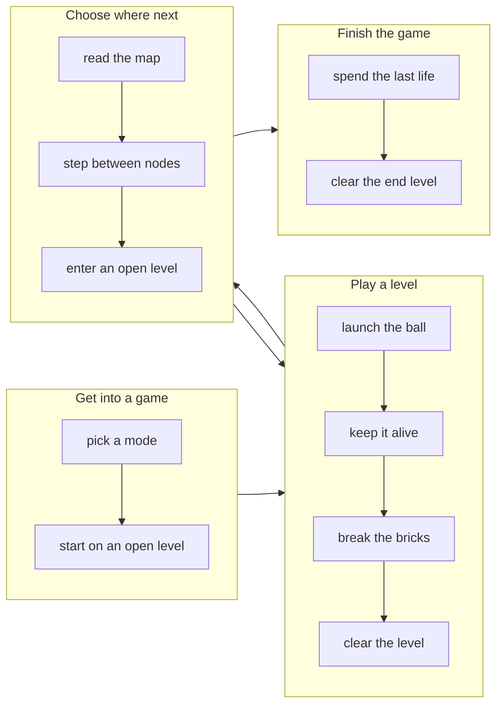

# Trazer — Implementation specification

**Owns.** How the product is operated and presented: what someone is trying to get done, and how
each surface behaves while they do it.

**Not here.** What the product *is* and the rules it obeys
([domain-spec.md](domain-spec.md)) · technology ([tech-spec.md](tech-spec.md)) · tokens and visual
states ([style-guide.md](style-guide.md)) · which of this is in the current release
([implementation-tracking.md](implementation-tracking.md)).

**Rule of thumb.** If it would still be true with a completely different interface, it belongs in
the domain spec. If it changes when the interface changes, it belongs here.

**Identifiers.** `IS-n.n` sits on **surface behaviours only**. Journeys carry none — they are
narrative, they get reworded often, and identity on a volatile thing is how citations rot. A
journey instead *names the surfaces it passes through*, and its end-to-end test cites that set.
Identity lives on the stable thing; the volatile thing points at it, exactly as `[?Hn]` works in
the domain spec.

Written by `/story-map`. Surface sections are filled in per goal, not up front —
see [workflow.md](workflow.md).

---

## How the two parts divide

**A journey says what someone does. A surface says how it behaves.** No sentence appears in both.

The division is strict, and it is what stops this document collapsing back into one pile:

| | Journey | Surface |
|---|---|---|
| Voice | *"picks a border, taps a clump"* | *"a tap under the drag threshold selects; past it, it is a pan"* |
| Changes when | the product's purpose changes | the interface changes |
| Reads as | continuous prose | a specification |

When a surface is central to a journey it is tempting to restate its behaviour so the journey
reads well. Don't. Name what the person is doing and link; a journey that has to explain a widget
is describing the widget, and the widget already has a section.

## Backbone

Small on purpose. It orients the prose below; it is not a map of the product, and it does not try
to be exhaustive. Every step here appears as a journey step below, and no journey step is missing
from it — `/sanity-check` reports either way round.

Mermaid renders in GitHub and in most editors' preview, so the diagram stays in the document
rather than beside it as an image nobody regenerates.

One actor throughout. Trazer has only the player until a level editor exists, so there is one
backbone rather than one per role. The arrow back from **C** to **B** is the loop the whole game
lives in; **D** is reached from it rather than after it.

---

# Part 1 — Journeys

## Get into a game
*Surfaces: §1 Game setup · §3 The map*

The player arrives wanting to play, and the only thing standing between them and a level is one
decision that cannot be taken back: Arcade or Journey (**DS-1.2**). The two are not difficulty
settings — they are different games over the same map, and the choice determines both what survives
a death and what reaching the end will ask of them (**DS-1.10**, **DS-1.11**).

Having chosen, they do not navigate anywhere first. A run opens directly on a level that is already
open for play (**DS-1.6**) — in Arcade always the start level, in Journey any level a previous game
left unlocked. Play begins immediately.

## Play a level
*Surfaces: §2 The arena*

The player launches the ball and keeps it alive while breaking bricks. This is where the game
actually is, and it is where this specification currently says least — the arena has not been
stormed, so the rules governing bats, hazards and capsules do not yet exist to be cited.

What is already fixed is the level's shape from the outside. A level ends exactly two ways: it is
cleared, or the run ends beneath it (**DS-1.14**). Losing a life is neither — play continues from
where it was, keeping everything the level has already lost (**DS-1.15**). There is nothing to
resume and no checkpoint: a level entered again always starts from its opening state (**DS-1.16**).

## Choose where next
*Surfaces: §3 The map*

With the level cleared, the player is back on the map, and this is the mechanic the whole
progression hangs on. They are not picking from a list — they step from node to connected node, in
any direction, including back across ground they have already covered, for as long as they like
(**DS-1.7**).

Moving is not playing. A step succeeds onto cleared, uncleared and locked nodes alike; what changes
is whether entering one starts anything. A level opens only when it is unlocked and has not already
been cleared *in this run* (**DS-1.8**), so walking back over a level finished ten minutes ago is
passage rather than a replay — while the same level in a later Journey run is open again
(**DS-1.3**).

## Finish the game
*Surfaces: §3 The map · §4 Endings*

Two endings, and which one the player is heading for depends on the choice they made at the start.

Spending the last life ends the run. In Arcade that is the game as well, and the player begins a new
one (**DS-1.4**). In Journey it costs them only the run: the map is as they left it, and a new run
starts from anywhere now open (**DS-1.5**). Dying is expensive in one mode and cheap in the other,
and that difference *is* the mode.

The other ending is the end level, reached by clearing one designated route in a single clean run in
Arcade (**DS-1.10**), or by having cleared every level on the map across as many runs as it took in
Journey (**DS-1.11**). Clearing it finishes the game, and it is the only ending that counts as
success in either mode (**DS-1.12**).

---

# Part 2 — Surfaces

Filled in per goal, at its specify step — not up front. A surface specified by someone who has not
built the one before it is a guess with an identifier on it.

## 1. Game setup
*Serves: Get into a game → pick a mode*

_Not specified yet._

## 2. The arena
*Serves: Play a level → launch the ball, keep it alive, break the bricks, clear the level*

_Not specified yet._

## 3. The map
*Serves: Choose where next → read the map, step between nodes, enter an open level*

_Not specified yet._

## 4. Endings
*Serves: Finish the game → spend the last life, clear the end level*

_Not specified yet._

---

# Future — how this might work

UX ideas deliberately not in this release: ways the product could look or be operated, as against
things it could *be*, which belong in [domain-spec.md](domain-spec.md)'s own Future section.
*Decided against, for now* goes to [implementation-tracking.md](implementation-tracking.md)'s
**Parked** — this section is for what has not been decided at all.
